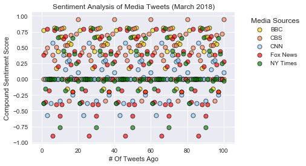
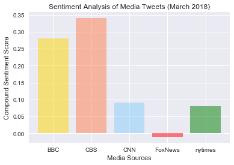

```python
# Dependencies
import tweepy
import json
import numpy as np
import matplotlib.pyplot as plt
import seaborn as sns
import pandas as pd

# Import and Initialize Sentiment Analyzer
from vaderSentiment.vaderSentiment import SentimentIntensityAnalyzer
analyzer = SentimentIntensityAnalyzer()

#import Twitter API keys
from config import access_token,access_token_secret,consumer_key,consumer_secret
```


```python
# Setup Tweepy API Authentication
auth = tweepy.OAuthHandler(consumer_key, consumer_secret)
auth.set_access_token(access_token, access_token_secret)
api = tweepy.API(auth, parser=tweepy.parsers.JSONParser())
```


```python
# Target Account
target_user = ["@BBC", "@CBS", "@CNN", "@FoxNews", "@nytimes"]


# Variables for holding sentiments
sentiments = []
# Loop through each user
for user in target_user:
    counter = 1
    
    # Loop through 5 pages of tweets (total 100 tweets each)
    for x in range(5):        
        # Get all tweets from home feed
        public_tweets = api.user_timeline(user)
        # Loop through all tweets
        for tweet in public_tweets:
            # Run Vader Analysis on each tweet
            compound = analyzer.polarity_scores(tweet["text"])["compound"]
            pos = analyzer.polarity_scores(tweet["text"])["pos"]
            neu = analyzer.polarity_scores(tweet["text"])["neu"]
            neg = analyzer.polarity_scores(tweet["text"])["neg"]
            # Variables for holding additional info
            user = tweet["user"]["screen_name"]
            
            tweets_ago  = counter


            # Add each value to the appropriate array
            sentiments.append({"Media Source":user,
                       "Compound": compound,
                       "Positive": pos,
                       "Negative": neu,
                       "Neutral": neg,
                       "Date": tweet["created_at"],
                       "Tweets Ago": counter,
                        "Tweet": tweet["text"]}) 
            counter= counter +1
```


```python
# Convert sentiments to DataFrame
total_sentiments = pd.DataFrame.from_dict(sentiments)
total_sentiments= total_sentiments[["Media Source", "Compound","Positive", "Negative","Neutral","Date","Tweets Ago","Tweet"]]
total_sentiments.head()
```


<div>
<style scoped>
    .dataframe tbody tr th:only-of-type {
        vertical-align: middle;
    }

    .dataframe tbody tr th {
        vertical-align: top;
    }

    .dataframe thead th {
        text-align: right;
    }
</style>
<table border="1" class="dataframe">
  <thead>
    <tr style="text-align: right;">
      <th></th>
      <th>Media Source</th>
      <th>Compound</th>
      <th>Positive</th>
      <th>Negative</th>
      <th>Neutral</th>
      <th>Date</th>
      <th>Tweets Ago</th>
      <th>Tweet</th>
    </tr>
  </thead>
  <tbody>
    <tr>
      <th>0</th>
      <td>BBC</td>
      <td>0.7717</td>
      <td>0.242</td>
      <td>0.758</td>
      <td>0.0</td>
      <td>Sun Apr 01 12:19:34 +0000 2018</td>
      <td>1</td>
      <td>RT @bbcweather: As the RAF celebrates 100 year...</td>
    </tr>
    <tr>
      <th>1</th>
      <td>BBC</td>
      <td>0.0000</td>
      <td>0.000</td>
      <td>1.000</td>
      <td>0.0</td>
      <td>Sun Apr 01 12:14:27 +0000 2018</td>
      <td>2</td>
      <td>Our favourite #AprilFoolsDay was when spaghett...</td>
    </tr>
    <tr>
      <th>2</th>
      <td>BBC</td>
      <td>0.0000</td>
      <td>0.000</td>
      <td>1.000</td>
      <td>0.0</td>
      <td>Sun Apr 01 12:00:24 +0000 2018</td>
      <td>3</td>
      <td>Could poetry be used as a form of therapy? htt...</td>
    </tr>
    <tr>
      <th>3</th>
      <td>BBC</td>
      <td>0.0000</td>
      <td>0.000</td>
      <td>1.000</td>
      <td>0.0</td>
      <td>Sun Apr 01 11:23:47 +0000 2018</td>
      <td>4</td>
      <td>RT @BBCOne: How not to prank your family this ...</td>
    </tr>
    <tr>
      <th>4</th>
      <td>BBC</td>
      <td>0.0000</td>
      <td>0.000</td>
      <td>1.000</td>
      <td>0.0</td>
      <td>Sun Apr 01 11:19:57 +0000 2018</td>
      <td>5</td>
      <td>RT @bbcpress: Julien lives! @TchekyKaryo repri...</td>
    </tr>
  </tbody>
</table>
</div>


```python
bbc_df= total_sentiments.loc[total_sentiments["Media Source"] == "BBC",:]
cbs_df= total_sentiments.loc[total_sentiments["Media Source"] == "CBS",:]
cnn_df= total_sentiments.loc[total_sentiments["Media Source"] == "CNN",:]
nyt_df= total_sentiments.loc[total_sentiments["Media Source"] == "nytimes",:]
fox_df= total_sentiments.loc[total_sentiments["Media Source"] == "FoxNews",:]
```


```python
total_sentiments.to_csv("Media_Sentiment_Data.csv", header = True)
```


```python
#Sentiment Analysis of Media Tweet (scatter plot)

sns.set()

bbc_plt= plt.scatter(bbc_df["Tweets Ago"], bbc_df["Compound"], 
                       color="gold", linewidth=1.0, alpha=0.65, edgecolors="black")
cbs_plt= plt.scatter(cbs_df["Tweets Ago"], cbs_df["Compound"], 
                       color="coral", linewidth=1.0, alpha=0.65, edgecolors="black")
fox_plt= plt.scatter(fox_df["Tweets Ago"], fox_df["Compound"], 
                       color="lightskyblue", linewidth=1.0, alpha=0.65, edgecolors="black")
cnn_plt= plt.scatter(cnn_df["Tweets Ago"], cnn_df["Compound"], 
                       color="red", linewidth=1.0, alpha=0.65, edgecolors="black")
nyt_plt= plt.scatter(nyt_df["Tweets Ago"], nyt_df["Compound"], 
                       color="green", linewidth=1.0, alpha=0.65, edgecolors="black")

labels = ["BBC", "CBS", "CNN", "Fox News", "NY Times"]

plt.legend(labels, bbox_to_anchor=(1.2, 1), 
          fancybox=True, shadow=True, ncol=1, loc='upper center', title="Media Sources")

plt.title("Sentiment Analysis of Media Tweets (March 2018)")
plt.xlabel("# Of Tweets Ago")
plt.ylabel("Compound Sentiment Score")
plt.savefig("Sentiment Analysis of Media Tweets_scatter.jpg")

plt.grid(True)
plt.show()
```





```python
x = total_sentiments["Media Source"].unique()
y = round((total_sentiments.groupby(["Media Source"])["Compound"].mean()),2)


plt.bar(x, y, color=["gold", "coral", "lightskyblue", "red", "green"], alpha=0.5, align="center")

plt.title("Sentiment Analysis of Media Tweets (March 2018)")
plt.xlabel("Media Sources")
plt.ylabel("Compound Sentiment Score")
plt.savefig("Sentiment Analysis of Media Tweets_bar.jpg")
plt.show()
```




